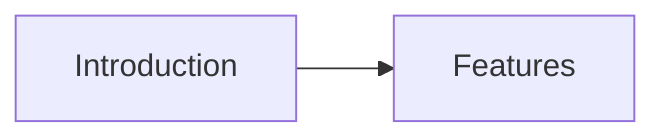

<p align="center">
  
  
  
  
</p>

<p align="center">
  <a href="README.md">English</a> | 
  <a href="README_CN.md">简体中文</a> | 
  <a href="README_TW.md">繁體中文</a>
</p>

<h1 align="center">🎨 CanvasTUI</h1>

<p align="center">
  <strong>A powerful terminal-based JSON Canvas (.canvas) viewer and editor</strong>
</p>

<p align="center">
  View, navigate, and edit Obsidian Canvas files directly in your terminal
</p>

---

## 🎉 Project Introduction

**CanvasTUI** is a feature-rich terminal user interface (TUI) application designed for viewing and editing JSON Canvas files. JSON Canvas is an open file format for infinite canvas data, popularized by Obsidian.

### Why CanvasTUI?

- 🔒 **Privacy First**: No need to open Obsidian to view your canvas files
- ⚡ **Lightning Fast**: Instant loading and navigation in terminal
- 🖥️ **Cross-Platform**: Works on Linux, macOS, and Windows
- 🔍 **Powerful Search**: Quickly find content across all nodes
- 📦 **Zero Dependencies**: Single binary distribution available

### Inspiration

This project was inspired by the need to quickly view and search canvas files without launching Obsidian. It provides a lightweight alternative for developers and power users who live in the terminal.

---

## ✨ Core Features

| Feature | Description |
|---------|-------------|
| 📝 **Node Viewing** | View all node types: text, file, link, and group nodes |
| 🔗 **Connection Display** | Visualize connections between nodes |
| 🔍 **Fast Search** | Search across all node content instantly |
| 📊 **Canvas Info** | Get statistics about your canvas files |
| 📤 **Export Options** | Export to JSON, Markdown, or Mermaid diagrams |
| 👀 **Live Watch** | Auto-reload when files change |
| 🎨 **Color Support** | Full 24-bit color support in terminal |
| ⌨️ **Keyboard Driven** | Efficient keyboard-only navigation |

---

## 🚀 Quick Start

### Requirements

- Python 3.10 or higher
- Terminal with ANSI color support

### Installation

```bash
# Using pip
pip install canvastui

# Using pipx (recommended for CLI tools)
pipx install canvastui

# From source
git clone https://github.com/gitstq/CanvasTUI.git
cd CanvasTUI
pip install -e .
```

### Quick Commands

```bash
# Open a canvas file in interactive mode
canvastui open my-canvas.canvas

# Show file information
canvastui info my-canvas.canvas

# List all nodes
canvastui list my-canvas.canvas

# Search nodes
canvastui search my-canvas.canvas "search term"

# Create new canvas
canvastui new my-new-canvas.canvas

# Export to different formats
canvastui export my-canvas.canvas output.md --format markdown
canvastui export my-canvas.canvas diagram.md --format mermaid
```

---

## 📖 Detailed Usage Guide

### Interactive Mode

Launch the interactive TUI with:

```bash
canvastui open my-canvas.canvas
```

#### Keyboard Shortcuts

| Key | Action |
|-----|--------|
| `q` | Quit application |
| `s` | Open search |
| `n` | New node |
| `e` | Edit selected node |
| `d` | Delete selected node |
| `w` | Toggle file watching |
| `j/k` | Navigate nodes |
| `Enter` | Select node |
| `Esc` | Clear selection |
| `?` | Show help |

### Command Line Options

#### `canvastui open`

Open a canvas file in interactive TUI mode.

```bash
canvastui open [FILE_PATH] [OPTIONS]

Options:
  --watch, -w    Watch for file changes and auto-reload
```

#### `canvastui info`

Display statistics about a canvas file.

```bash
canvastui info FILE_PATH
```

Output includes:
- Node count
- Edge count
- Canvas bounds
- Node type breakdown

#### `canvastui list`

List all nodes in a canvas file.

```bash
canvastui list FILE_PATH [OPTIONS]

Options:
  --type, -t TEXT    Filter by node type (text, file, link, group)
```

#### `canvastui search`

Search for content in nodes.

```bash
canvastui search FILE_PATH QUERY
```

Search is case-insensitive and searches across:
- Node text content
- Node labels
- File paths
- URLs

#### `canvastui export`

Export canvas to different formats.

```bash
canvastui export FILE_PATH OUTPUT [OPTIONS]

Options:
  --format, -f TEXT    Output format: json, markdown, mermaid
```

### Example: Export to Mermaid

```bash
canvastui export my-canvas.canvas diagram.md --format mermaid
```

Output:


---

## 💡 Design Philosophy & Roadmap

### Design Philosophy

CanvasTUI is built with these principles in mind:

1. **Simplicity**: Clean, intuitive interface
2. **Performance**: Fast loading and responsive navigation
3. **Extensibility**: Easy to add new features and export formats
4. **Compatibility**: Full support for the JSON Canvas specification

### Technology Choices

- **Textual**: Modern TUI framework with excellent widget support
- **Rich**: Beautiful terminal formatting and rendering
- **Pydantic**: Robust data validation
- **Click**: Intuitive CLI interface

### Roadmap

| Version | Features |
|---------|----------|
| v1.1 | Node editing capabilities |
| v1.2 | Edge creation and modification |
| v1.3 | Multiple canvas tabs |
| v1.4 | Plugin system for custom exporters |
| v1.5 | Collaboration features |

---

## 📦 Build & Deployment

### Building from Source

```bash
# Clone repository
git clone https://github.com/gitstq/CanvasTUI.git
cd CanvasTUI

# Install development dependencies
pip install -e ".[dev]"

# Run tests
pytest

# Build package
python -m build
```

### Creating Standalone Binary

```bash
# Using PyInstaller
pip install pyinstaller
pyinstaller --onefile canvastui/cli.py --name canvastui
```

### Docker Support

```dockerfile
FROM python:3.10-slim
RUN pip install canvastui
ENTRYPOINT ["canvastui"]
```

---

## 🤝 Contributing

We welcome contributions! Here's how to get started:

1. Fork the repository
2. Create a feature branch (`git checkout -b feature/amazing-feature`)
3. Commit your changes (`git commit -m 'feat: add amazing feature'`)
4. Push to the branch (`git push origin feature/amazing-feature`)
5. Open a Pull Request

### Commit Convention

We follow the [Conventional Commits](https://www.conventionalcommits.org/) specification:

- `feat:` New features
- `fix:` Bug fixes
- `docs:` Documentation updates
- `refactor:` Code refactoring
- `test:` Test additions/changes
- `chore:` Maintenance tasks

---

## 📄 License

This project is licensed under the MIT License - see the [LICENSE](LICENSE) file for details.

```
MIT License

Copyright (c) 2026 gitstq

Permission is hereby granted, free of charge, to any person obtaining a copy
of this software and associated documentation files (the "Software"), to deal
in the Software without restriction, including without limitation the rights
to use, copy, modify, merge, publish, distribute, sublicense, and/or sell
copies of the Software, and to permit persons to whom the Software is
furnished to do so, subject to the following conditions:

The above copyright notice and this permission notice shall be included in all
copies or substantial portions of the Software.
```

---

<p align="center">
  Made with ❤️ by <a href="https://github.com/gitstq">gitstq</a>
</p>
